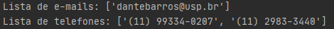
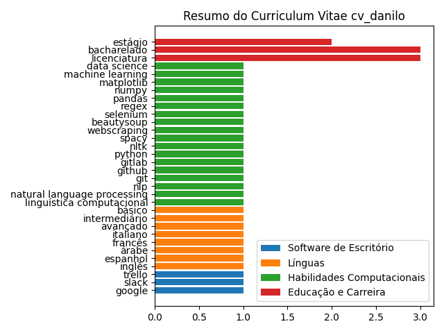

# Analisador automático de Curriculum Vitae
<a name="intro"></a>
## Sumário
1. [Introdução](#git1)
2. [Estado atual do programa](#git2)
3. [Como utilizar](#git3)
4. [Instalação](#git4)
      1. [NLTK](#git4.1)

### 1. Introdução  <a name="git1"></a> [🠡](#intro)
O curriculum vitæ ("trajetória de vida") ou CV é um documento com o tamanho de uma página A4 contendo a trajetória educacional e de carreira de alguém. O objetivo desse tipo de currículo é mostrar sucintamente como a pessoa pode se encaixar em algum projeto, vaga de emprego e outras oportunidades (educacionais e profissionais). As habilidades e competências são levadas em conta.

O presente **Analisador Automático de Curriculum Vitae** tem como objetivo ler o documento (PDF ou Word) e extrair de lá as seguintes informações:
1. Entidades (instituições educacionais, empresas);
2. Análise de sentimento (se o texto traz sentimentos positivos, negativos, neutros);
3. Nível de língua (qual a língua e qual o nível de fluência);
4. Informações pessoais do candidato.

### 2. Estado atual do programa  <a name="git2"></a> [🠡](#intro)

O que o programa faz:
1. decodificar arquivos PDF textuais;
2. realizar a limpeza de linhas vazias e de alguns caracteres estranhos;
3. encontrar e-mails e números de telefone no texto (por enquanto são apenas **printados**);
4. procurar palavras-chave separadas por tema e exibir em um gráfico (o gráfico é salvo como imagem na pasta _'cv_files'_.

O que o programa consegue porém não estou utilizando:
1. implementar análises do NLTK (que não estão funcionando bem para a língua portuguesa);
2. remover stop words e pontuações.

O que ainda quero fazer:
1. extrair nome e endereço do candidato;
2. quando possível (precisa de um modelo bem treinado), realizar análise de sentimentos, extração de sintagmas, etc.


### 3. Como utilizar:  <a name="git3"></a> [🠡](#intro)
1. insira o currículo PDF na pasta cv_files;
2. em _analisador-curriculum-vitae.py_, modifique o nome do arquivo pdf a ser analisado na seguinte variável: ``nome_pdf = 'cv_danilo'``, onde cv_danilo é o meu currículo _cv_danilo.pdf_
3. altere as listas _palavras_chave1, 2, 3_ e _4_ de acordo com o que você quer encontrar em um currículo.
4. execute o código python. Será exibido o gráfico em janela, e a imagem é salva na pasta _'cv_files'_

### 4. Instalação  <a name="git4"></a> [🠡](#intro)

Faça um Virtual Environment Python 3.7 através de sua IDE ou através da Command Line:
1. Instale o virtualenv através do comando pip ``pip install virtualenv``
2. Crie o ambiente virtual através do comando abaixo, escolhendo o **path** e o **executável** do Python 3.7:

a. Windows:
```
cd my-project
virtualenv --python C:\Path\To\Python\python.exe venv
```
b. Linux: 
```
cd /path/para/seus/projetos/projeto
virtualenv .
```

O ambiente virtual será criado e executado. Agora, você pode instalar quaisquer bibliotecas que somente o ambiente virtual será afetado. Isso significa que seu python raíz não reconhecerá as bibliotecas instaladas dentro de um virtual environment.

Para instalar as dependências do projeto, abra o Virtual Environment e execute o comando ``pip install -r requirements.txt``

#### 4.1 NLTK  <a name="git4.1"></a> [🠡](#intro)
A biblioteca de Natural Language Processing (NLP) NLTK vai ser instalada no comando ``pip install requirements.txt``, porém é necessário executar, dentro de seu terminal do virtual environment, os seguintes comandos:
```
python # Para executar o python, faça isso dentro do virtual environment
import nltk
nltk.download()
```
Após executar os comandos acima, a janela NLTK Downloader abrirá. Clique duas vezes na opção all-nltk para baixar os pacotes de ferramenta. Aguarde pois o download e instalação podem demorar alguns minutos.
